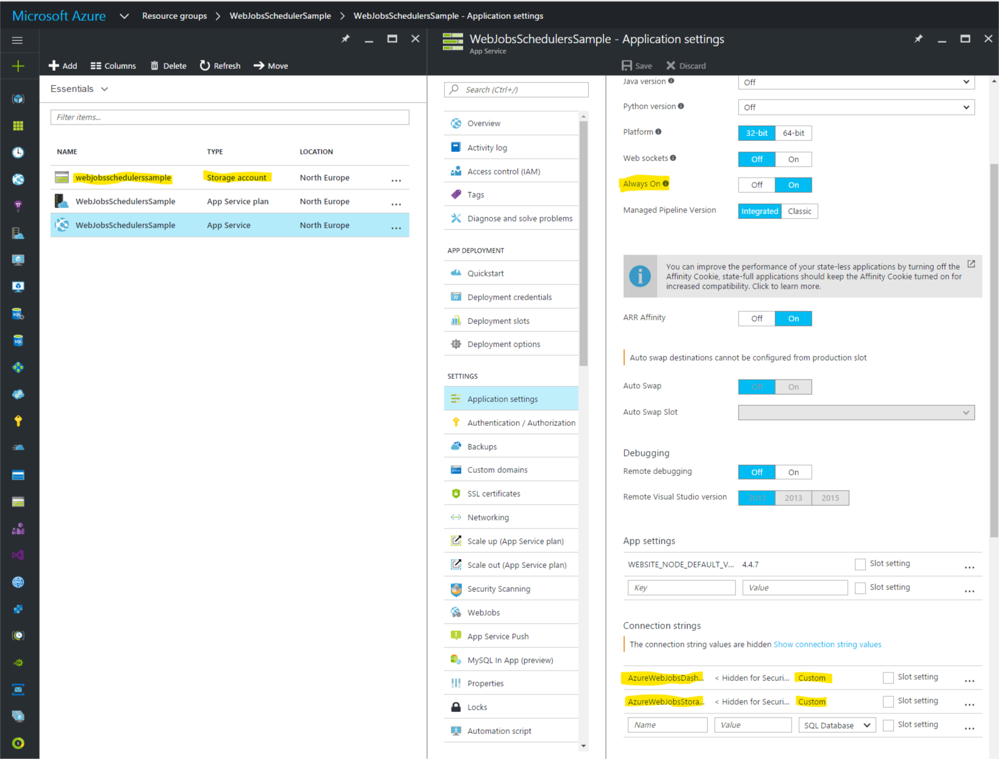
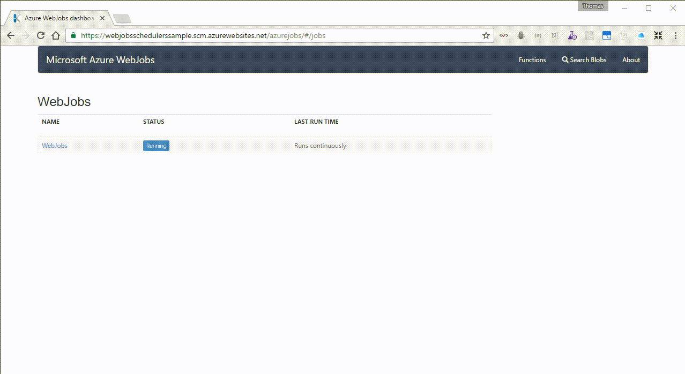

#### Azure Web Job Sample
This project demonstrates how to use the Azure Web Job SDK to host a ASP.NET Website and a Azure WebJob on a single Azure Website instance. This means the WebJob and website share the same resources.

The WebJob is hosting 3 different kinds of functions:
* A continously running WebJob Function
* A scheduled WebJob Function that runs every day at 1AM
* A triggered WebJob Function, that can be activated manually from the Azure Dashboard (se gif video below)

The project is created to demonstrate a bug in the scheduled function. Some times it does not run at 1AM, but at 0:59:59.9xx (a few milli seconds before). In these cases the scheduled job stops working, and will not run until the WebJob is restarted.

Click the button below to deploy the sample project to Azure. Please make sure to select a paid dedicated (not shared) App Service Plan to enable configuration of Always On.

When deployed created a Azure Storage Account, and configure thee connection strings for `AzureWebJobsDashboard` and `AzureWebJobsStorage` on the following form:
`DefaultEndpointsProtocol=https;AccountName=[AccountName];AccountKey=[AccountKey]`

This is how the Azure Dashboard looks and how to trigger the manual WebJob function
